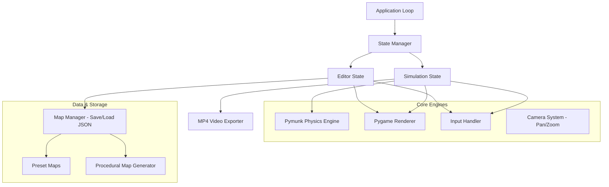
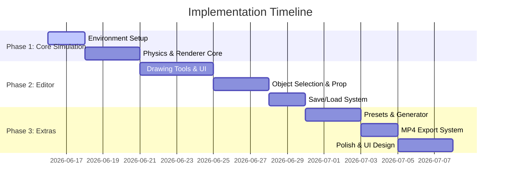

# Project Plan: 2D Physics Marble Race Simulator & Editor (Algodoo-style)

This project is a 2D physics simulation game for marble racing, featuring a full-featured map editor, map presets, random map generation, and MP4 video export capabilities. It uses **Python**, **Pygame** for rendering/UI, and **Pymunk** (a Chipmunk2D wrapper) for highly accurate 2D physics.

---

## 1. Core Architecture

The game is structured as a state machine containing a **Physics Sandbox**, a **Map Editor**, and a **Video Export Engine**.

---

## 2. Technology Stack & Dependencies

| Library | Purpose | Rationale |
| :--- | :--- | :--- |
| **Pygame** | UI, Rendering, Input Management | Standard, lightweight, highly responsive, support for fullscreen and raw pixel editing. |
| **Pymunk** | 2D Physics Engine | Wrapper for Chipmunk2D. Highly accurate rigid-body dynamics (collisions, elasticity, friction, gravity, joints) — far more stable than a custom physics engine for complex tracks. |
| **OpenCV (`opencv-python`)** | MP4 Video Writing | Easy compilation of Pygame frames into a compressed MP4 video directly from memory buffer (no external dependencies like FFmpeg required). |

> [!NOTE]
> Standardizing on `pymunk` ensures we get robust collision response, complex polygons, and constraints (joints, motors) without typical custom-engine glitches like marbles clipping through walls.

---

## 3. Detailed Feature Specifications

### A. Level Editor (Editor Berkemampuan Penuh)
- **Drawing Tools**:
  - *Static Wall (Segment)*: Draw lines for marbles to roll on.
  - *Polygonal/Box Obstacles*: Create solid static or dynamic shapes.
  - *Circular Obstacles/Bumper*: Bounces marbles away.
  - *Boost Pad / Accelerator*: Apply custom force vectors to marbles passing through.
  - *Portal (Teleporter)*: Teleport marbles from portal A to portal B.
  - *Marble Spawner*: Grid or line emitter for marbles with configurable colors.
  - *Finish Line*: Trigger detection when marbles cross it.
- **Selection & Property Tool**:
  - Select any object to move, rotate, delete, or modify properties.
  - Modifiable Properties: Elasticity (bounciness), friction, density/mass, color, and behavior (static vs. dynamic).
- **Control System**:
  - Undo/Redo stack for all edit actions.
  - Grid snap toggle for precise alignments.
  - Save / Load tracks to JSON files.

### B. Simulation Mode
- **Camera Controls**:
  - Pan: Middle-mouse drag / Right-click drag.
  - Zoom: Mouse scroll wheel.
  - Follow Mode: Auto-focus and track the leading marble, the average position, or a selected marble.
- **Race Controls**:
  - Pause, Resume, Reset (return all marbles to spawn, clear paths).
  - Time Speed Modifier (0.5x, 1x, 2x, 5x speed).

### C. Procedural Map Generator
- Generates tracks using a seed-based procedural system:
  1. **Path Generation**: Generates a main descending path (using Sine waves, Bezier curves, or steps).
  2. **Obstacle Placement**: Adds pegs (Plinko-style), spinner wheels, slides, and acceleration zones along the path.
  3. **Start & Finish**: Places a closed starting box (that opens when the race starts) at the top and a finish line sensor at the bottom.

### D. MP4 Video Exporter
- **Workflow**:
  1. User clicks "Start Recording".
  2. The simulation resets and runs at a fixed timestep (e.g., exactly $\Delta t = 1/60$s per frame) rather than real-time.
  3. Each rendered frame is captured as a raw RGB buffer using `pygame.image.tostring`.
  4. The buffers are written frame-by-frame to a `cv2.VideoWriter` stream.
  5. The user clicks "Stop Recording", and the video is finalized as an `.mp4` file.
  - *Benefit*: Since simulation speed is decoupled from rendering speed during export, the resulting video is perfectly smooth at 60 FPS even if the computer lags during rendering.

---

## 4. Design & Aesthetics (Modern Dark/Neon Theme)
To wow the user, the visualization will not be plain:
- **Color Palette**: Sleek dark slate background, glowing neon tracks (e.g., cyan, magenta, lime), and glowing marbles.
- **Visual Effects**:
  - Speed-based trailing effects (motion blur particle trails for fast marbles).
  - Tiny collision particles.
  - Clean font rendering (using fonts like *Inter* or *Outfit* loaded dynamically).
  - Modern minimalistic HUD showing lead standings, timer, and current speed.

---

## 5. Phased Implementation Plan

---

## 6. Next Steps & User Feedback

Before writing the codebase, we need to choose the approach for dependencies:
1. **Pymunk & OpenCV installation**: We can install `pymunk` and `opencv-python` to implement the physics engine and MP4 export.
2. **Preset Map Concepts**: Let's decide if there are specific presets you want to see (e.g., Plinko, Helix, Loop-the-loop).

Let us know if you approve this plan or want to modify any details!
